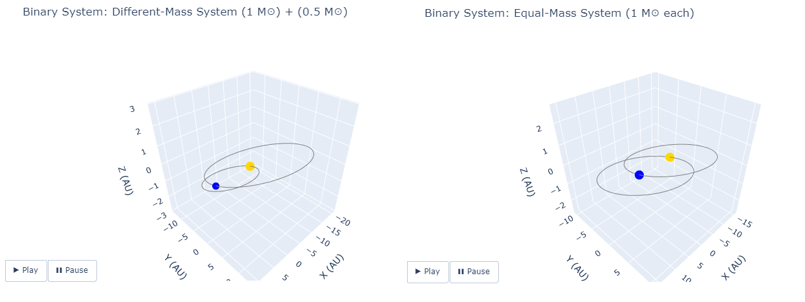

# Binary Star System Visualizations

This project provides interactive visualizations of various types of binary star systems using Python and Plotly. It is organized into separate Jupyter notebooks for clarity and future extensibility.

I developed this project with significant guidance from AI tools. They helped me bridge gaps in coding knowledge—assisting with structuring, debugging, and refining the code. 

## Notebooks

- [Visual Binary System](notebooks/01_visual_binary.ipynb) – Simulates and animates 3D orbits of binary stars for both equal- and unequal-mass configurations. Also includes a case study of Alpha Centauri AB using its observed parameters.
- Other binaries – *Coming soon*

## Requirements

See [`requirements.txt`](requirements.txt) for required Python packages.

## Sample Output

## License

This project is licensed under the MIT License.
